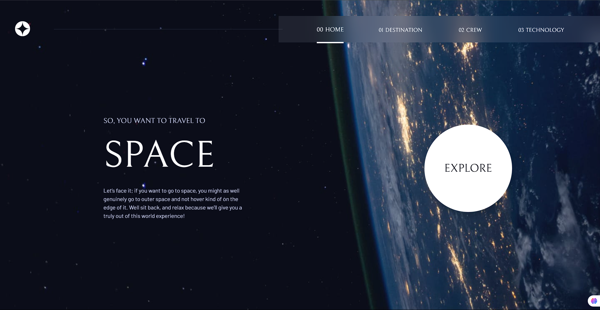

# Frontend Mentor - Space tourism website solution

This is a solution to the [Space tourism website challenge on Frontend Mentor](https://www.frontendmentor.io/challenges/space-tourism-multipage-website-gRWj1URZ3).

## Introduction
This is a space tourism website in which a brief overview of how space tourism happening in future look like. Please check this website this amazing it took me 14+ hrs to build this thing. Please check it out

### Screenshot

### Links

- Solution URL: [here](https://www.frontendmentor.io/solutions/space-tourism-website-solution-ZXNSPnUZqU)
- Live Site URL: [here](https://sunilbaghel002.github.io/space-tourism-website/index.html)

## My process

### Built with

- Semantic HTML5 markup
- CSS custom properties
- CSS Variables
- CSS Flexbox
- CSS Keyframes
- CSS Media Queries
- Basic JS
- DOM Manipulation
- Advance JS

# 🚀🚀🚀